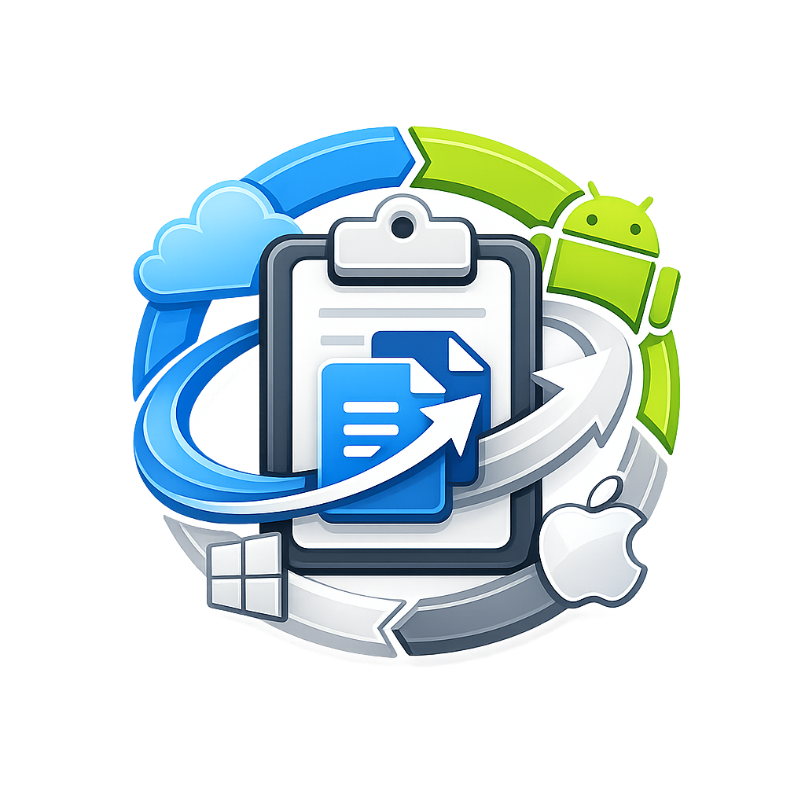

<div align="center">
  
  <h1>ClipRelay</h1>
  <p><strong>LAN-first · Encrypted · Multi-device clipboard & file relay</strong></p>
  
  [](https://github.com/ChinmayyK/ClipRelay/actions/workflows/ci.yml)
  [](https://opensource.org/licenses/MIT)
</div>

<br />

ClipRelay syncs your clipboard and files across all your devices on your local network — privately, instantly, and without any cloud servers or accounts required.

## ✨ Key Features

- 🔒 **End-to-End Encryption:** All data in transit is encrypted using X25519 ECDH and ChaCha20-Poly1305 AEAD.
- 🌐 **True Mesh Networking:** Three or more devices sync simultaneously. Peer-aware fanout and deduplication prevent echo storms in large meshes.
- ⚡ **LAN-First Architecture:** Operates entirely over your local network using mDNS discovery. No internet connection needed.
- 📁 **File Transfer Support:** Stream large files over the mesh with chunking, SHA-256 checksum verification, progress tracking, and failure recovery.
- 🛡️ **Fine-Grained Device Control:** Manage connected peers with granular state layers (Trust, Remembered, Connected, Sync Enabled, Auto-connect).
- 🏷️ **Human-Readable Identity:** See clean device names (e.g., "Chinmay's Pixel 8") instead of cryptographic hashes across all UIs.

## 📱 Supported Platforms

ClipRelay provides native experiences across all major operating systems:

| Platform | Status | Implementation Details |
|---|:---:|---|
| **macOS** | ✅ | Native SwiftUI app (`ProxiBoard`) + IPC client |
| **Android** | ✅ | Kotlin foreground service + JNI bridge, ambient notifications |
| **Windows** | ✅ | WinForms app + Named Pipe client |
| **Linux** | ✅ | System service + GTK4 tray app |

## 🏗️ Architecture

ClipRelay is built on a high-performance Rust core that powers all platform-specific clients.

```text
cliprelay-core/   Rust engine (networking, crypto, sync, IPC)
cliprelay-cli/    Command-line interface to the daemon
platforms/
  android/        Android app with JNI integration
  macos/          macOS SwiftUI application
  linux/          Linux system service and tray integration
  windows/        Windows desktop application
```

### IPC Protocol (Daemon ↔ UI)
Communication between the Rust engine and platform UIs happens via JSON over Unix domain sockets (`~/.run/cliprelay.sock`) or Windows Named Pipes (`\\.\pipe\cliprelay`). This ensures high performance and clean separation of concerns.

## 🔒 Security Model

Security is built-in from the ground up:
- **Key Exchange:** X25519 ECDH + HKDF key derivation per session.
- **Encryption:** ChaCha20-Poly1305 AEAD encryption for all messages and file chunks.
- **Trust Model:** Trust-on-first-use (TOFU) with fingerprint verification. Trust relationships, revocations, and rejections are fully persistent.

## 🛠️ Building from Source

### Prerequisites
- [Rust toolchain](https://rustup.rs/) (Cargo)
- Platform-specific build tools (Xcode for macOS, Android Studio / SDK for Android, .NET for Windows)

### Build Commands

```bash
# 1. Build the Rust core engine (all platforms)
cargo build --release -p cliprelay-core

# 2. Build the Command Line Interface
cargo build --release -p cliprelay-cli

# 3. Build platform apps (macOS / Android)
./scripts/build-macos.sh
./scripts/build-android.sh
```

## 🤝 Contributing

Contributions are welcome! Please check out our [Contributing Guidelines](CONTRIBUTING.md) for details on how to get started, our code of conduct, and development workflows.

## 📝 License

This project is licensed under the MIT License - see the [LICENSE](LICENSE) file for details.
