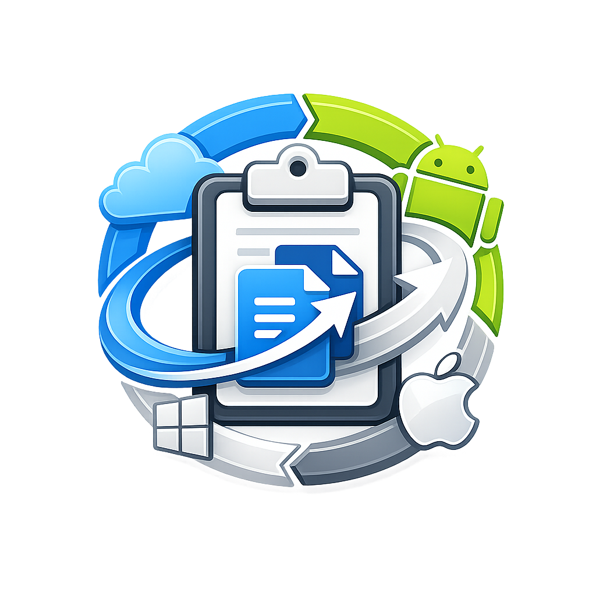
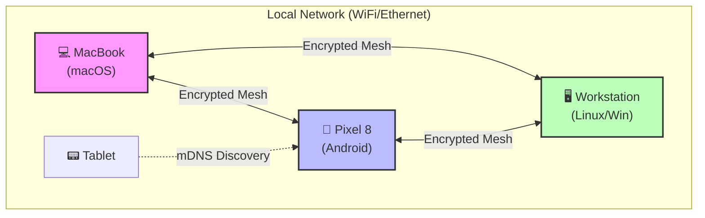
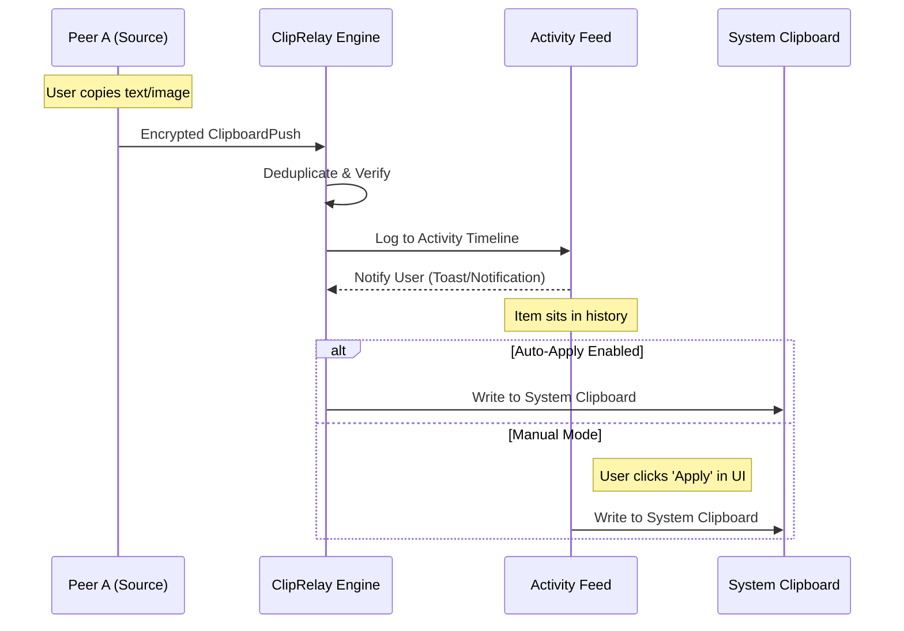
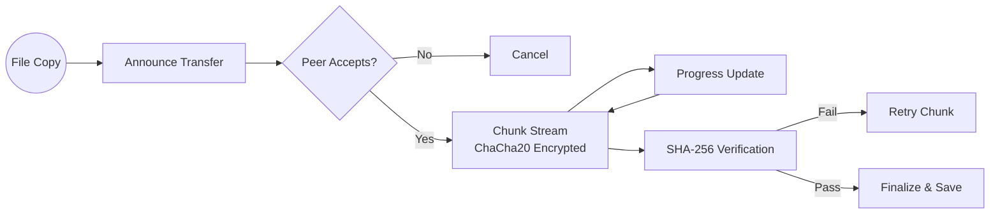
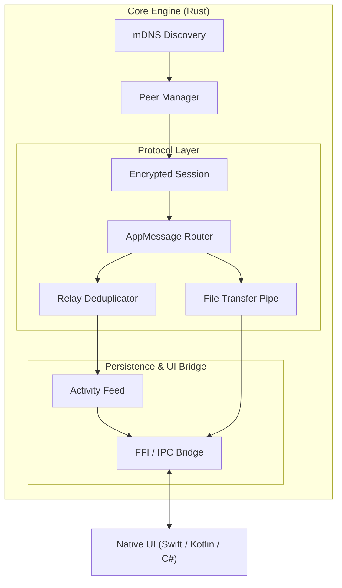

<div align="center">
  
  <h1>ClipRelay</h1>
  <p><strong>Local-First · Encrypted · Multi-Device Continuity System</strong></p>

  <div>
    
    
    
    
  </div>

  <br />

  **ClipRelay** is a sophisticated, local-first infrastructure for seamless multi-device continuity. It transforms your local network into a private, encrypted mesh where clipboard state, files, and activity move fluidly between your devices without ever leaving your network or touching the cloud.
</div>

---

## 2. What Is ClipRelay?

In a world of fragmented ecosystems, moving a simple snippet of text or a high-resolution photo between a MacBook, an Android phone, and a Linux workstation should be instantaneous and invisible. Most solutions today rely on cloud intermediaries, introducing latency, privacy risks, and dependency on an active internet connection.

**ClipRelay** is built on a different philosophy: **Local-First Continuity.**

It treats your devices not as isolated silos, but as a cooperative mesh. By leveraging high-speed local networking and modern cryptographic primitives, ClipRelay ensures that your digital "work context" follows you. Whether you copy a URL on your phone or a large ZIP archive on your desktop, ClipRelay handles the discovery, encryption, and propagation automatically.

---

## 3. Key Features

- 🕸️ **True Mesh Propagation:** Not just point-to-point. Content fanned out across all trusted devices in the mesh with intelligent deduplication.
- 🕒 **Timeline-First Workflow:** Incoming clipboard items are staged in an activity feed. You choose when to "Apply" them, preventing accidental overwrites of your local clipboard.
- 📂 **High-Performance File Transfer:** Resumable, chunked streaming designed for large files, featuring SHA-256 integrity verification.
- 🔐 **Zero-Knowledge Privacy:** Every session is end-to-end encrypted with **ChaCha20-Poly1305** and established via **X25519 ECDH**. No cloud, no accounts, no tracking.
- 📡 **Seamless Discovery:** Automatic peer detection via mDNS (ZeroConf). Works over Wi-Fi, Ethernet, and mobile hotspots.
- 📋 **Rich Activity Feed:** A unified history of all shared content, allowing you to travel back through your continuity timeline across all devices.
- 🛡️ **Trust-Based Pairing:** Secure TOFU (Trust On First Use) model with human-readable fingerprint verification.

---

## 4. Architecture Overview

ClipRelay is built as a distributed system of independent engines that coordinate over a secure local mesh.

### High-Level System Architecture
The mesh is decentralized; any device can initiate a relay, and peers act as both consumers and propagators.



### Clipboard Propagation Flow
ClipRelay uses a "Timeline-First" approach. Incoming content is placed in the Activity Feed first, giving the user control over the local system clipboard.



### File Transfer Pipeline
Files are streamed in 64KB chunks to maintain responsiveness and allow for progress tracking.



### Internal Engine Flow
The Rust-based core engine (`cliprelay-core`) manages the complex lifecycle of mesh communication.



---

## 5. How It Works

### Peer Discovery & Trust
ClipRelay uses **mDNS** to find peers without any configuration. On the first connection, devices exchange long-term public keys. You verify a short fingerprint (TOFU) to establish a permanent trust bond.

### Encrypted Sessions
Once trusted, peers establish ephemeral session keys using **X25519 Diffie-Hellman**. Every message—whether a small text snippet or a gigabyte-sized file—is encrypted using **ChaCha20-Poly1305** AEAD, ensuring both confidentiality and authenticity.

### Mesh Relay & Deduplication
To ensure "Continuity everywhere," ClipRelay doesn't just send data to one peer; it propagates it to the entire trusted mesh. To prevent infinite loops (echo storms), the engine implements a sophisticated deduplication layer that tracks content hashes and origin metadata.

---

## 6. Demo & Interface

| Android Continuity | macOS Timeline |
|:---:|:---:|
|  |  |
| *Seamless background sync via Foreground Service* | *Activity-first history with 'Apply' control* |

---

## 7. Supported Platforms

| Platform | Core Engine | UI / Integration | Status |
|:---|:---:|:---|:---|
| **macOS** | Rust | SwiftUI / AppKit | Production-ready |
| **Android** | Rust (JNI) | Kotlin / Foreground Service | Production-ready |
| **Linux** | Rust | GTK4 / Libadwaita | Beta / WIP |
| **Windows** | Rust | C# / WinUI 3 | Beta / WIP |
| **iOS** | - | - | Researching (Backgrounding limits) |

---

## 8. Tech Stack

- **Core Engine:** Rust (Async/Await via Tokio)
- **Networking:** Custom framing over TCP + mDNS-SD
- **Security:** X25519, ChaCha20-Poly1305, SHA-256 (RustCrypto)
- **Android:** Kotlin, JNI, WorkManager, Foreground Services
- **macOS:** Swift, SwiftUI, AppKit
- **IPC:** Unix Domain Sockets (macOS/Linux), Named Pipes (Windows)

---

## 9. System Design Highlights

- **Local-First by Design:** No central server. Even if your internet goes out, your continuity mesh remains functional.
- **Backpressure Aware:** File transfers use a pull-based chunking mechanism to ensure slow peers don't overwhelm the network.
- **Energy Efficient:** Android integration uses Foreground Services and low-frequency mDNS polling to minimize battery impact.
- **Atomic Operations:** All clipboard and file writes are atomic, preventing corrupted states during sudden disconnections.

---

## 10. Setup & Running

### Prerequisites
- Rust 1.75+
- Android Studio (for Android build)
- Xcode 15+ (for macOS build)

### Build the Core
```bash
# Clone the repository
git clone https://github.com/ChinmayyK/ClipRelay.git
cd ClipRelay

# Build the Rust workspace
cargo build --release
```

### Platform Setup
- **macOS:** Open `platforms/macos/ClipRelay.xcodeproj` and run.
- **Android:** Open `platforms/android` in Android Studio, ensure NDK is installed, and deploy to device.
- **Linux:** Run `cargo run -p cliprelay-linux`.

---

## 11. Security & Privacy

ClipRelay is designed with a **Privacy-First** threat model:
- **No Cloud:** Your data never leaves your physical premises.
- **Perfect Forward Secrecy:** Ephemeral session keys ensure that even if a device's long-term key is compromised, past sessions remain secure.
- **Auditability:** The core engine is written in memory-safe Rust, eliminating entire classes of security vulnerabilities like buffer overflows.

---

## 12. Design Philosophy

**Continuity should be calm.** 
ClipRelay doesn't bombard you with alerts. It quietly maintains a high-fidelity mirror of your digital context across your devices. The **Timeline-First** UX is a deliberate choice to keep you in control: a copy on your phone shouldn't violently disrupt what you are currently doing on your computer.

---

## 13. Current Limitations

- **Network Boundary:** Devices must be on the same subnet (or reachable via VPN like Tailscale).
- **iOS Backgrounding:** Apple's strict backgrounding rules make a "silent" core engine difficult on iOS without a central push server.
- **Android Clipboard:** Modern Android versions restrict background clipboard access; ClipRelay uses a dedicated notification-based 'Push' trigger to maintain reliability.

---

## 14. Roadmap

- [ ] **Native Windows Client:** High-performance WinUI 3 application.
- [ ] **Linux Polish:** Native system tray and Flatpak packaging.
- [ ] **Multi-Network Relay:** Secure relaying over Tailscale/Wireguard.
- [ ] **Remote Command Execution:** Optional, secure execution of specific actions (e.g., "Open URL on MacBook").

---

## 15. Contributing

Contributions are welcome! Please see [CONTRIBUTING.md](CONTRIBUTING.md) for our engineering guidelines and code of conduct.

---

## 16. License

This project is licensed under the **MIT License**. See [LICENSE](LICENSE) for details.
