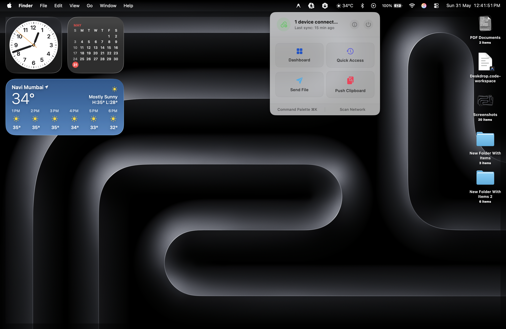
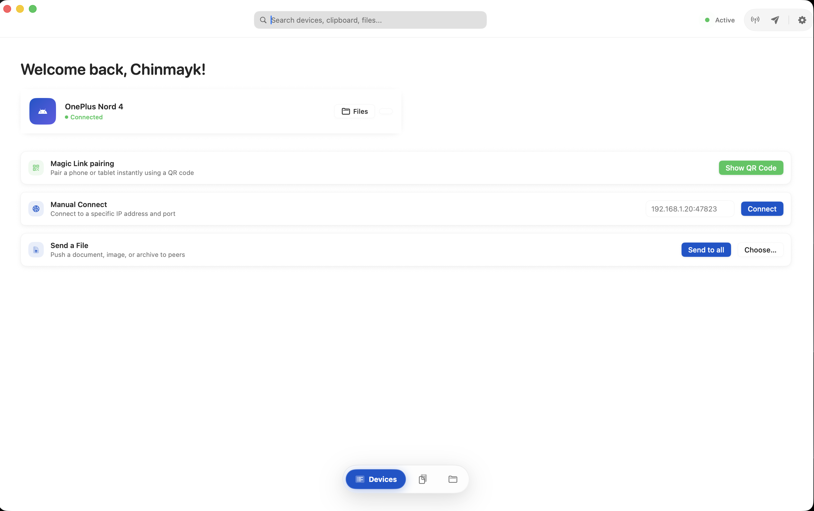
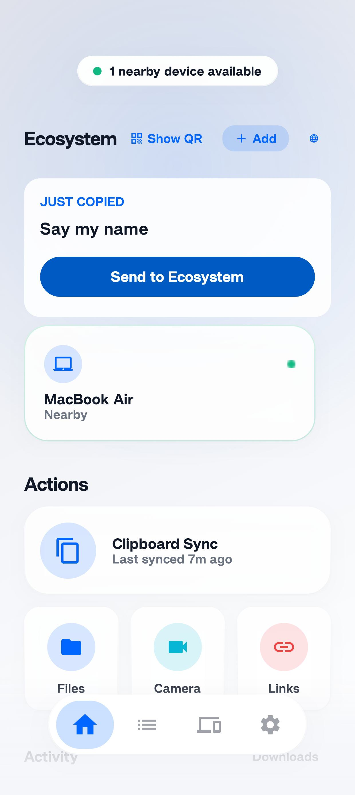
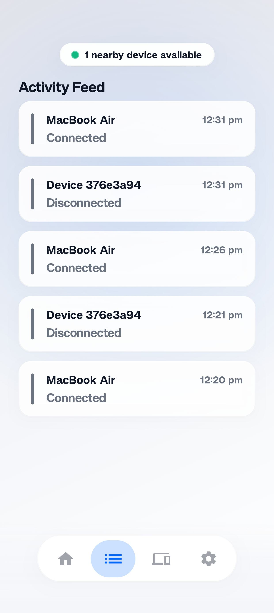

# Deskdrop

<div align="center">

  <p><strong>A local-first, zero-cloud desktop and mobile continuity engine for resumable file transfers, clipboard synchronization, and hardware interaction across mixed operating systems.</strong></p>

  <div>
    
    
    
    
    
  </div>

  <br />

  <table>
    <tr>
      <td align="center"><b>macOS Menu Bar Dropzone</b></td>
      <td align="center"><b>macOS Activity Dashboard</b></td>
      <td align="center"><b>Android Client & Timeline</b></td>
    </tr>
    <tr>
      <td align="center"></td>
      <td align="center"></td>
      <td align="center"> &nbsp; </td>
    </tr>
  </table>

</div>

---

## Overview

Deskdrop bridges disparate operating systems (macOS, Windows, Android, Linux) without relying on intermediate cloud infrastructure, proprietary ecosystem lock-in, or external routing servers. All communication takes place point-to-point over local wireless networks (Wi-Fi, LAN, or standalone Wi-Fi Direct / Mobile Hotspot connections).

At its core sits an event-driven asynchronous **Rust daemon (`deskdrop-core`)**, designed for zero idle resource consumption and low-latency local IPC communication with platform-native graphical frontends. Whether transferring multi-gigabyte payloads or synchronizing high-frequency clipboard updates, Deskdrop relies strictly on local system primitives and explicit end-to-end encryption.

---

## Core Capabilities

Deskdrop focuses primarily on two battle-tested primitives: resilient local file transport and high-speed universal clipboard synchronization.

### 1. Resumable & Zero-Copy File Transport
Sending files across a local network shouldn't stall due to transient packet loss or intermittent interface drops. Deskdrop implements a streaming transport layer engineered for high saturation and resiliency:
- **Zero-Copy Memory Pipelines (`bytes::Bytes`)**: The networking core operates on reference-counted memory slices. Buffer slicing ($O(1)$ complexity) across asynchronous reading channels prevents redundant heap allocation and RAM duplication during massive file relays.
- **Adaptive Chunk Batching (`adaptive_batch_size`)**: Outbound file transmission dynamically adjusts read-ahead queue depth based on live acknowledgment feedback (`next_chunk - last_acked_chunk`). High-bandwidth links scale up concurrent operations, while congested links throttle down automatically to prevent memory spikes or timeout drops.
- **Geometric Socket Auto-Tuning**: Sockets apply geometric buffer fallback progressions (`16 MB` down to `256 KB`), securing the largest OS kernel buffer (`SO_SNDBUF` / `SO_RCVBUF`) supported by the local network interface.
- **Resumable Transfers & Fast Entropy Sampling**: Mid-transfer interruptions resume seamlessly without starting over. Prior to compression stages, the engine performs a brief 4 KB entropy check (`should_try_compress`); incompressible binaries (`.mp4`, `.zip`, `.jpg`) immediately bypass CPU compression cycles.

### 2. Real-Time Universal Clipboard & Timeline
- **Cross-Platform Activity Feed**: Copying text, URLs, or image payloads on one device transmits structured payload metadata across trusted peer sockets in real time. Items appear inside a searchable local history ring buffer with support for pinning and tagging.
- **Configurable Content Filtering (`filter.rs`)**: To safeguard passwords, One-Time Passwords (OTPs), API keys, and credit cards from persisting on unattended hardware, Deskdrop evaluates clipboard contents against local pre-flight heuristic rules and regular expressions before initiating network broadcasts.
- **Deduplicated FFI String Caching**: Across C-FFI boundaries (`PbEvent::cache_str`), common heap strings are recycled during high-frequency IPC updates, avoiding unneeded allocations within UI view loops.

---

## Extended Modules

In addition to core file and clipboard synchronization, Deskdrop includes several secondary modules built atop the secure peer connection layer:
- **Remote Directory Browsing**: Navigate explicitly permitted filesystem directories on remote paired machines over local sockets to fetch specific documents on demand.
- **Wireless Continuity Camera**: Route live mobile camera feeds to desktop video clients over local Wi-Fi without proprietary drivers or cables.
- **Notification & Call Handoff**: Mirror mobile SMS messages, phone call alerts, and application notifications directly to desktop notification centers.
- **Power & Battery Monitoring**: Surface remote hardware battery status (`0–100%`) and charging states directly within desktop system trays.
- **OS-Level Sleep Immunity**: Leverages platform power management primitives (`ProcessInfo.beginActivity` on macOS, `SetThreadExecutionState` on Windows, and selective wake locks on Android) during ongoing bulk transfers to prevent unintended system suspension.

---

## Cryptography & Session Security

Deskdrop operates under a zero-trust model for local wireless broadcast networks. Device discovery over mDNS does not imply trust.

- **End-to-End Encryption**: Session handshakes utilize ephemeral **Curve25519 (X25519) ECDH** key exchanges, **HKDF-SHA256** key derivation, and **ChaCha20-Poly1305** authenticated encryption (`AEAD`).
- **Replay Protection**: All network frames integrate strictly increasing 64-bit counter nonces, rejecting unordered or replayed packet transmission at the parsing layer.
- **Memory Zeroization**: Secret Diffie-Hellman keys and session material are zeroed directly from physical RAM immediately upon derivation or termination via the `zeroize` crate to mitigate memory exposure.
- **mDNS Privacy Enforcer**: Friendly device names are obfuscated during general network broadcasting; only unprivileged UUID identifiers are visible over open mDNS until a cryptographic pairing verification concludes.
- **PIN-Verified Trust On First Use (TOFU)**: Initial device pairing enforces an out-of-band numeric PIN confirmation (`PairingPin`), preventing active Man-in-the-Middle (MITM) redirection on untrusted networks.

---

## Platform Feature Parity & Architecture

Deskdrop combines a unified high-performance Rust core with platform-native interface runtimes:

| Platform | Frontend Stack | IPC / Binding Mechanism | Current Status & Notes |
| :--- | :--- | :--- | :--- |
| **macOS** | Swift & SwiftUI | Direct C-FFI / Unix Sockets | 🟢 **Production Ready** (Menu bar integration, native notifications, continuity camera support) |
| **Android** | Kotlin & Jetpack Compose | JNI Bridge | 🟢 **Production Ready** (Background service runtime, native share-sheet target, QR/PIN pairing) |
| **Linux** | GTK3 & D-Bus | Unix Sockets / D-Bus | 🟢 **Production Ready** (XDG notification integration, `systemd` user service runtime) |
| **Windows** | WPF / .NET 8 Hybrid | Named Pipes / C-FFI | 🟠 **Alpha / Experimental** (Active developmental architecture; GUI layer undergoing stabilization) |

---

## Capability Comparison Matrix

Below is a technical feature comparison between Deskdrop and existing cross-platform or proprietary continuity utilities:

| Capability / Domain | Deskdrop (Ours) | LocalSend | KDE Connect | Apple Handoff / AirDrop | Microsoft Phone Link |
| :--- | :--- | :--- | :--- | :--- | :--- |
| **Supported Operating Systems** | macOS, Windows, Android, Linux | macOS, Windows, Android, Linux, iOS | macOS, Windows, Android, Linux | macOS, iOS, iPadOS only | Windows, Android, iOS (Limited) |
| **Primary Architecture** | Event-driven Rust daemon + Native UIs | Flutter (Dart) single-process app | Qt / C++ background daemon | Native OS kernel & system daemons | Native Windows OS / Background service |
| **File Transfer Transport** | Zero-copy TCP/IP & Wi-Fi Direct | TCP/IP HTTP network serving | TCP/IP custom socket payloads | Wi-Fi Direct / Apple Custom Wireless | Wi-Fi Direct / Cloud-relayed hybrid |
| **Resumable Pipeline Architecture** | Yes (Chunk-level ack verification) | No (Restart required on drop) | Partial / Protocol dependent | No (Fail on signal loss) | Partial (Depends on file target) |
| **Universal Clipboard Timeline** | Yes (With searchable local ring buffer)| No (Manual text sending only) | Yes (Basic real-time string copy) | Yes (Real-time paste, no history feed)| Yes (Select Android hardware only) |
| **Sensitive Data Filtering (OTP Guard)**| Yes (Configurable regex / heuristics)| N/A | No | No | No |
| **Remote Filesystem Access** | Yes (Zero-trust secure directory browsing)| No | Yes (SFTP filesystem mounting) | No | No (Gallery sync only) |
| **Notification & Call Mirroring** | Yes | No | Yes | Yes (Apple hardware only) | Yes |

---

## Getting Started & Usage

### Prerequisites for Compiling from Source
- **Rust Toolchain**: Stable version `1.75+` (managed via [rustup](https://rustup.rs/)).
- **C Compiler & Build Tools**: Needed for native cryptography bindings (`build-essential` on Linux, `Xcode command-line tools` on macOS).

### 1. Unified Automated Build & Install
To clean, recompile the core Rust daemon, and install both the macOS application bundle and Android APK simultaneously:

```bash
# Clone repository
git clone https://github.com/ChinmayyK/Deskdrop.git
cd Deskdrop

# Compile and install targets in Debug mode
./scripts/reinstall-all.sh --debug

# Compile optimized release builds
./scripts/reinstall-all.sh --release
```

### 2. Platform-Specific Manual Builds

#### macOS App Bundle (`Deskdrop.app`)
```bash
# Compile macOS universal target and stage to /Applications
./scripts/build-macos.sh --debug
cp -a platforms/macos/build/Deskdrop.app /Applications/
open /Applications/Deskdrop.app
```

#### Android APK (`com.deskdrop.debug`)
```bash
# Assemble debugging APK and deploy to a USB-connected Android device via ADB
./scripts/build-android.sh --debug --fast-abi
adb install -r platforms/android/app/build/outputs/apk/debug/app-debug.apk
adb shell monkey -p com.deskdrop.debug -c android.intent.category.LAUNCHER 1
```

#### Linux Desktop (`deskdrop-linux`)
```bash
# Launch GTK native client directly via Cargo
cargo run -p deskdrop-linux
```

#### Windows Client (`Deskdrop.WinUI` - WPF / .NET Hybrid)
```bash
# Compile native core dynamic library for Windows
cargo build --release -p deskdrop-core

# Build and register desktop client using PowerShell installer script
powershell -ExecutionPolicy Bypass -File platforms/windows/Deskdrop.WinUI/install_and_run.ps1
```

---

## Command-Line Interface (CLI)

For headless operations, system administration, and custom terminal script automation, Deskdrop offers a native command-line utility (`deskdrop-cli`) communicating directly with the background daemon over low-latency IPC sockets:

```bash
# Print daemon health, version, and active listening ports
cargo run -p deskdrop-cli -- status

# Benchmark IPC domain socket round-trip latency
cargo run -p deskdrop-cli -- ping
# Output: PONG (1.1ms)

# Display real-time throughput metrics, transfer counters, and latency percentiles
cargo run -p deskdrop-cli -- metrics

# Query recent local clipboard history records
cargo run -p deskdrop-cli -- history --last 15

# Lock a history record to prevent automatic buffer eviction
cargo run -p deskdrop-cli -- history pin <id>

# Enumerate active discovered and trusted peer nodes on local subnet
cargo run -p deskdrop-cli -- devices list

# Toggle sync permissions for specific hardware UUIDs
cargo run -p deskdrop-cli -- devices peer-settings <device-id> pause
cargo run -p deskdrop-cli -- devices peer-settings <device-id> resume
```

---

## Configuration & Local Storage

Deskdrop maintains clean configuration boundaries conforming to OS standard conventions:

| Platform | Configuration & Storage Directory |
| :--- | :--- |
| **macOS** | `~/Library/Application Support/deskdrop/` |
| **Linux** | `~/.config/deskdrop/` |
| **Windows** | `%APPDATA%\deskdrop\` |

- `settings.json`: User runtime configurations, interface bindings, and custom filtering heuristics.
- `peers.json`: Locally cached network peers, mDNS mappings, and device nicknames.
- `trust.json`: Persistent public keys of verified trusted nodes.
- `history.json`: Bounded NDJSON ring buffer logging historical payloads and activity events.
- `identity.json`: Local cryptographic device identity key pair (`Curve25519`, stored with strict `0600` POSIX permissions).

> [!CAUTION]
> The `identity.json` file contains your device's private identity keys used for network authentication and DH key exchange. Do not expose, commit, or transfer this file across insecure channels.

---

## Contributing, Security & Licensing

- **Contributing**: Please review [CONTRIBUTING.md](CONTRIBUTING.md) for architectural documentation, code formatting rules, and pull request submission guidelines.
- **Security Policy**: To report potential cryptographic weaknesses, memory safety issues, or vulnerability exploits, refer to [SECURITY.md](SECURITY.md) for coordinated disclosure procedures.
- **Changelog**: Release history and API modifications are documented in [CHANGELOG.md](CHANGELOG.md).

### License & Commercial Notice
Deskdrop is distributed under the **GNU Affero General Public License v3.0 (AGPL-3.0)**. 

*Note on AGPL-3.0*: This license explicitly enforces network copyleft. Any modifications, derived network daemons, or cloud-relayed SaaS implementations built upon this engine must make their complete source code available under the same terms. See [LICENSE](LICENSE) for full legal text.
