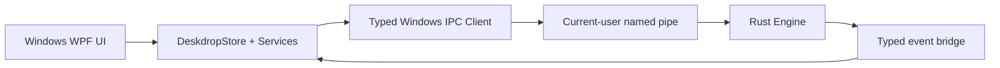
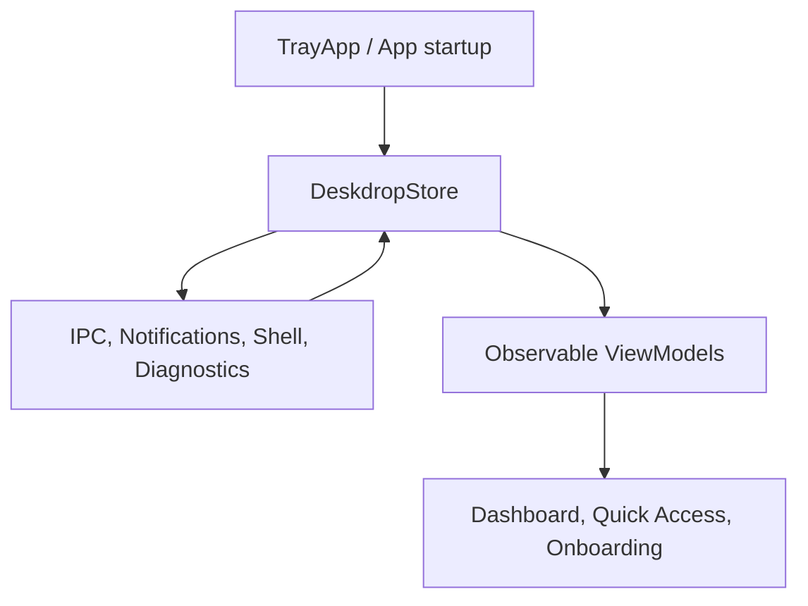

# Deskdrop Windows App Ultimate Frontend and Backend Polish Audit

Date: May 28, 2026

Scope: `platforms/windows/Deskdrop.Windows`, `deskdrop-core/src/ffi.rs`, `deskdrop-core/src/ipc.rs`, `deskdrop-core/src/ipc_windows.rs`, and the parity target set by `platforms/macos/Deskdrop` plus `platforms/android/app`.

This document supersedes the earlier Windows polish notes where they treated a macOS-like Windows visual system as a problem. The product decision is now explicit: Windows should share the same Deskdrop visual language as macOS and Android. The audit below therefore does not recommend a Windows-native restyle as the goal. The goal is a highly polished, consistent, premium Deskdrop app that still behaves correctly on Windows.

## Executive Verdict

Windows has moved forward materially. The current app now has:

- a macOS-style WPF dashboard with Transfers and Ecosystem sections
- onboarding window
- QR pairing window
- tray app
- quick access timeline
- global hotkeys
- taskbar jump list actions
- Explorer context menu installer
- command palette
- drag and drop overlay
- transfer action buttons
- basic diagnostics and support bundle export
- toast notifications
- camera preview and camera publishing classes
- backend IPC helper methods for many of the missing commands

However, it is still not equal to macOS and Android. The problem is no longer just missing UI. The deeper problem is that many polished-looking Windows affordances do not yet have the same reliable backend truth, event delivery, state model, error handling, security posture, and OS-level behavior that macOS and Android already have.

The shortest summary:

- The visual direction can stay consistent with macOS and Android.
- The implementation needs a much stronger contract between Rust core, Windows FFI, named-pipe IPC, and WPF state.
- Several Windows flows look complete but still fail silently, use placeholder data, or are not wired end-to-end.
- The Windows app should be treated as a first-class platform shell, not a set of WPF surfaces wrapped around partially connected backend calls.

## Product Bar

The finished Windows app should feel like this:

- It starts silently, remains alive, and recovers from sleep, Wi-Fi changes, firewall friction, and stale pipes without user babysitting.
- First run walks the user through network readiness, QR/manual pairing, trust verification, and a verified sample send.
- The dashboard has durable sections for Devices, Activity, Transfers, Settings, and Diagnostics.
- Quick Access is instant, searchable, keyboard-friendly, and useful without opening the full dashboard.
- Transfers show exact state: incoming, waiting, transferring, paused, verifying, complete, failed, cancelled.
- Every action has trustworthy feedback: optimistic UI where safe, rollback where needed, and errors with repair options.
- Settings are one model across platforms, not Windows registry drift plus partial daemon state.
- Notifications work from Action Center, not only while the WPF object remains alive.
- Security-sensitive moments are explicit: trust, fingerprint, PIN, local network, clipboard privacy, support exports.
- UI polish is not only visual; it includes focus, keyboard, screen reader names, high DPI, reduced motion, dark mode, and no jank.

## Baseline To Match

### macOS Target

macOS is currently the strongest reference for the desktop shell:

- `platforms/macos/Deskdrop/DeskdropStore.swift:21` has a broad observable state model: peers, active trust prompt, running status, status line, pending clipboard count, activity feed, transfers, settings, call state, and battery state.
- `platforms/macos/Deskdrop/DeskdropStore.swift:232` deduplicates peers, computes reconnectable state, maps active transfers, updates active calls only when values actually change, and mirrors battery state.
- `platforms/macos/Deskdrop/DeskdropStore.swift:729` supports activity refresh, incremental activity polling, apply clipboard, timeline-first mode, auto-apply mode, settings save, transfer accept/reject/cancel/pause/resume, and toast feedback.
- `platforms/macos/Deskdrop/ActivityFeedView.swift:8` exposes search, filters, grouped activity, pending clipboard banners, and inline transfer banners.
- `platforms/macos/Deskdrop/TransfersDashboardView.swift:3` has a real transfer dashboard with active cards, incoming actions, progress, speed, ETA, history, and reveal-in-Finder behavior.
- `platforms/macos/Deskdrop/CommandPaletteView.swift:19` has grouped commands, dynamic per-device actions, sync toggle state, network scan, and clipboard history command results.
- `platforms/macos/Deskdrop/PreferencesView.swift:220` has deep settings: identity, login, onboarding replay, appearance, notifications, sync modes, content types, max payload, ignore patterns, security, network, and history.
- `platforms/macos/Deskdrop/MenuBarPopoverView.swift:14` provides compact status, primary actions, command palette, scan, diagnostics, and quit.
- `platforms/macos/Deskdrop/DiagnosticsView.swift:3` has repair actions, not just read-only status.

### Android Target

Android is the strongest reference for resilience and OS integration:

- `platforms/android/app/src/main/java/com/deskdrop/DeskdropService.kt:1` documents the background strategy: foreground service, wake behavior, notification channels, action notifications, and activity feed instead of notification spam.
- `platforms/android/app/src/main/java/com/deskdrop/DeskdropService.kt:47` exposes a broad JNI bridge for clipboard, file transfer, trust, pairing, camera, call, battery, network restoration, and peer discovery.
- `platforms/android/app/src/main/java/com/deskdrop/DeskdropService.kt:200` models activity entries with apply state, transfer IDs, total bytes, progress, speed, ETA, and destination path.
- `platforms/android/app/src/main/java/com/deskdrop/DeskdropService.kt:272` maintains active transfer state and quick send context flows for the UI.
- `platforms/android/app/src/main/java/com/deskdrop/DeskdropService.kt:313` defines notification actions for accept, reject, cancel, pause, and resume file transfers.
- `platforms/android/app/src/main/java/com/deskdrop/DeskdropService.kt:430` uses wake, Wi-Fi, and multicast locks to protect background network behavior.
- `platforms/android/app/src/main/java/com/deskdrop/DeskdropService.kt:2415` registers network callbacks and notifies the engine when the network is restored.
- `platforms/android/app/src/main/java/com/deskdrop/ui/MainScreen.kt:112` gives Android a unified visual shell with status strip, animated tabs, quick actions, activity, devices, settings, and active transfers.
- `platforms/android/app/src/main/java/com/deskdrop/ui/OnboardingScreen.kt:29` implements a multi-step onboarding flow: find device, QR/manual IP, pairing, sample send, completion.
- `platforms/android/app/src/main/java/com/deskdrop/DiagnosticsActivity.kt:24` provides diagnostics with repair actions for service, network, clipboard mode, and OEM battery restrictions.
- `platforms/android/app/src/main/java/com/deskdrop/DeskdropTileService.kt:57` adds Quick Settings and share target integrations.

## Windows Current Snapshot

The Windows app is no longer a thin wrapper. It has meaningful surface area:

- `platforms/windows/Deskdrop.Windows/MainWindow.xaml:281` defines Transfers UI.
- `platforms/windows/Deskdrop.Windows/MainWindow.xaml:351` defines Ecosystem/Devices UI.
- `platforms/windows/Deskdrop.Windows/MainWindow.xaml:462` defines Settings UI.
- `platforms/windows/Deskdrop.Windows/MainWindow.xaml:520` defines Diagnostics UI.
- `platforms/windows/Deskdrop.Windows/MainWindow.xaml:636` defines incoming call banner UI.
- `platforms/windows/Deskdrop.Windows/MainWindow.xaml:671` defines drag/drop overlay UI.
- `platforms/windows/Deskdrop.Windows/MainWindow.xaml:685` defines command palette UI.
- `platforms/windows/Deskdrop.Windows/MainWindow.xaml.cs:18` wires the dashboard to `ClipboardManager` and `DeskdropStore`.
- `platforms/windows/Deskdrop.Windows/DeskdropStore.cs:30` creates a shared observable store.
- `platforms/windows/Deskdrop.Windows/WindowsIpcClient.cs:47` sends JSON commands to the `deskdrop` named pipe.
- `platforms/windows/Deskdrop.Windows/Program.cs:1155` is the Windows entry point and single-instance host.
- `platforms/windows/Deskdrop.Windows/Program.cs:731` creates the tray application and starts the embedded engine.
- `deskdrop-core/src/ffi.rs:70` now starts a Windows IPC server from the embedded engine by using `crate::ipc::handle_ipc_request`.

The big positive change is that Windows FFI now reuses the shared IPC request handler instead of a limited local dispatcher. That is the right architectural direction. The remaining work is to make every Windows feature consume that contract correctly and to close ABI gaps between the C# side and Rust side.

## Most Important Correction From The Previous Audit

Do not spend time making Windows look unlike macOS.

The correct design goal is:

- same Deskdrop visual identity across Windows, macOS, and Android
- same spacing rhythm, cards, blue/green/red semantic colors, bottom dock language, and friendly continuity tone
- Windows-specific behavior only where OS behavior demands it: Action Center, tray, Explorer, startup, windowing, accessibility, high contrast, Snap, DPI, and notification activation

Therefore, the "visual style" work should focus on implementation quality:

- centralized design resources instead of duplicated XAML resources
- dark mode and system theme parity
- reduced motion mode
- keyboard focus and accessibility
- high DPI and multi-monitor correctness
- no missing resources
- no placeholder copy
- consistent component states

## P0 Blockers

These are blockers for calling the Windows app polished.

### P0.1 Resource And Runtime Integrity

The app has at least one clear runtime resource break:

- `platforms/windows/Deskdrop.Windows/OnboardingWindow.xaml:9` references `Styles.xaml`.
- No `Styles.xaml` exists under `platforms/windows/Deskdrop.Windows`.

This likely prevents `OnboardingWindow` from loading at runtime. Since onboarding is now part of first-run, this is a release blocker.

Other integrity issues:

- `platforms/windows/Deskdrop.Windows/Program.cs:64` imports `deskdrop_push_camera_frame`.
- `deskdrop-core/src/ffi.rs:737` exports `deskdrop_push_video_frame`, not `deskdrop_push_camera_frame`.
- `platforms/windows/Deskdrop.Windows/Program.cs:439` calls the missing import, so camera broadcasting can fail with `EntryPointNotFoundException`.
- `platforms/windows/Deskdrop.Windows/DropZoneWindow.xaml.cs:17` implements `Window_Loaded`, but `platforms/windows/Deskdrop.Windows/DropZoneWindow.xaml:1` does not hook `Loaded="Window_Loaded"`. The DPI/multi-monitor positioning code never runs.
- `platforms/windows/Deskdrop.Windows/MainWindow.xaml.cs:220` still opens `QRCodeWindow(GetLocalIPAddress(), "000000")`, so one command palette path shows a fake PIN and raw IP QR rather than the real Magic Link.
- `platforms/windows/Deskdrop.Windows/OnboardingWindow.xaml.cs:30` has the same fake QR path.

Required fix:

- Add a real shared XAML resource dictionary or inline onboarding resources safely.
- Rename or alias the FFI camera export so C# and Rust agree.
- Hook `DropZoneWindow` loaded lifecycle.
- Remove all fake QR/PIN entry points and route all pairing to `QRPairingWindow`.
- Add a startup self-check that validates key resources, DLL exports, IPC reachability, and notification identity before opening the dashboard.

Acceptance:

- Fresh install opens onboarding with no XAML resource exception.
- Every QR entry point produces the same `deskdrop://pair?...` payload.
- Camera broadcast starts or shows a specific permission/device/backend error.
- Drop zone opens on the active monitor with correct DPI.

### P0.2 FFI Event ABI Mismatch

The Windows C# event bridge is not aligned with the Rust event contract.

Examples:

- C# defines `PB_EVENT_INCOMING_CALL = 8` in `platforms/windows/Deskdrop.Windows/Program.cs:30`.
- Rust defines event code `8` as `PB_EVENT_CLIPBOARD_SYNCED` in `deskdrop-core/src/ffi.rs:223`.
- Rust defines call state as `17` in `deskdrop-core/src/ffi.rs:230`.
- C# does not handle Rust event `17`, so call-state events from the core do not reach the Windows dashboard correctly.

The accessor problem is larger:

- C# uses `deskdrop_event_text` for warnings at `platforms/windows/Deskdrop.Windows/Program.cs:599`.
- C# uses `deskdrop_event_text` for call device ID at `platforms/windows/Deskdrop.Windows/Program.cs:607`.
- C# uses `deskdrop_event_text` for activity JSON at `platforms/windows/Deskdrop.Windows/Program.cs:614`.
- Rust `deskdrop_event_text` only returns text for `EngineEvent::ClipboardReceived` at `deskdrop-core/src/ffi.rs:332`.

That means several Windows event handlers are effectively reading `null` even when Rust emitted useful events.

TOFU is also unsafe:

- Rust exposes `deskdrop_event_device_id` at `deskdrop-core/src/ffi.rs:503`.
- C# has the import commented out in `platforms/windows/Deskdrop.Windows/Program.cs:83`.
- C# falls back to `var id = name` in `platforms/windows/Deskdrop.Windows/Program.cs:571`.

Required fix:

- Generate event constants from Rust or put them in one shared header used by all platform bindings.
- Add/repair C# imports for every exported accessor used by Windows.
- Extend Rust accessors for warning text, activity JSON, call fields, notification fields, file transfer speed/ETA/bytes, battery fields, and camera stream fields.
- Remove all name-as-device-id fallbacks.
- Add a Windows ABI contract test that loads `deskdrop_core.dll` and asserts required exports exist.

Acceptance:

- A pairing prompt gives Windows the real device UUID.
- A call-state event updates the Windows call banner.
- A remote notification event has title/body/app/source data.
- A warning event displays the warning text.
- A file transfer progress event can expose percent, bytes, speed, ETA, status, and transfer ID.

### P0.3 IPC Error And Timeout Contract

The IPC response schema is mismatched:

- Rust serializes errors as `{ "status": "error", "message": "..." }` from `deskdrop-core/src/ipc.rs:343`.
- Windows reads an `error` field in `platforms/windows/Deskdrop.Windows/WindowsIpcClient.cs:66`.

This makes many Windows errors become `"Unknown IPC error"`.

Timeout behavior is also risky:

- `platforms/windows/Deskdrop.Windows/WindowsIpcClient.cs:25` uses a global 1000 ms timeout.
- `platforms/windows/Deskdrop.Windows/WindowsIpcClient.cs:124` implements timeout by doing blocking one-byte reads in a loop.
- If the server stalls in a blocking read, the timeout is not a robust cancellation boundary.
- macOS IPC uses a 10 second guarded request path at `deskdrop-core/src/ipc.rs:1171`.

Required fix:

- Read `message`, not `error`.
- Return a typed result object: success, daemon unavailable, timeout, parse failure, command error.
- Use async named-pipe APIs or set read timeouts on the stream.
- Use per-command timeouts: health 300-500 ms, status 1-2 s, file/diagnostics/settings 5-10 s.
- Surface error text to UI and diagnostics.

Acceptance:

- Invalid device ID shows "invalid device id", not "Unknown IPC error".
- Hung IPC does not block the UI thread or background poll indefinitely.
- Diagnostics can display last IPC command failure with command tag, duration, and error class.

### P0.4 State Store Is Not Yet A Real Product Store

`DeskdropStore` is the right direction, but it is still too shallow:

- `platforms/windows/Deskdrop.Windows/DeskdropStore.cs:47` polls every second via `DispatcherTimer`.
- `platforms/windows/Deskdrop.Windows/DeskdropStore.cs:120` starts a new background task on every tick without a concurrency guard.
- If a slow IPC request overlaps the next tick, state updates can race.
- `ActivityFeed` and `PendingClipboards` are created at `platforms/windows/Deskdrop.Windows/DeskdropStore.cs:41`, but `ParseDaemonState` does not populate them.
- `platforms/windows/Deskdrop.Windows/DeskdropStore.cs:186` mutates existing peer objects in place.
- `platforms/windows/Deskdrop.Windows/DeskdropStore.cs:214` mutates existing transfer objects in place.
- `PeerViewModel` and `FileTransferState` do not implement `INotifyPropertyChanged` in `platforms/windows/Deskdrop.Windows/MainWindow.xaml.cs:534` and `platforms/windows/Deskdrop.Windows/MainWindow.xaml.cs:563`.

That means WPF bindings can stay stale for status, battery, progress, and computed properties.

Required fix:

- Add an `IsRefreshInFlight` guard and cancellation token.
- Use typed models that implement `INotifyPropertyChanged`.
- Update computed properties whenever raw properties change.
- Populate `ActivityFeed` via `activity_recent` and incremental `activity_since`.
- Populate `PendingClipboards` via `pending_remote_clipboards`.
- Stop using one-off list assignments outside the store.
- Make the store the only state owner for peers, transfers, activity, settings, call, battery, diagnostics, and notifications.

Acceptance:

- Transfer progress updates live without removing/re-adding rows.
- Device status and battery update live.
- Pending clipboard count updates between status polls.
- Quick Access and dashboard show the same timeline.
- No two timers can mutate state concurrently.

### P0.5 Pairing And Trust Are Not End-To-End

Current good pieces:

- `platforms/windows/Deskdrop.Windows/QRPairingWindow.xaml.cs:63` now builds a real `deskdrop://pair?name=...&ip=...&port=...&fingerprint=...` URL.
- `platforms/windows/Deskdrop.Windows/MainWindow.xaml:363` exposes Magic Link pairing.
- `platforms/windows/Deskdrop.Windows/OnboardingWindow.xaml:36` lays out a first-run flow.

Remaining gaps:

- `OnboardingWindow` likely fails because of missing `Styles.xaml`.
- Onboarding uses a three-card static story, not a live stepper tied to discovered peers and sample send.
- `platforms/windows/Deskdrop.Windows/MainWindow.xaml.cs:420` shows onboarding only when no peers exist, but it does not load the persisted `HasCompletedOnboarding` setting.
- `platforms/windows/Deskdrop.Windows/MainWindow.xaml.cs:430` marks onboarding complete whenever the onboarding window closes, including close or skip.
- `platforms/windows/Deskdrop.Windows/Program.cs:1058` writes `HasCompletedOnboarding`, but the dashboard's `_hasCompletedOnboarding` starts as false and is not initialized from `LoadSettings`.
- `platforms/windows/Deskdrop.Windows/NotificationHelper.cs:40` implements toast action callbacks only for the lifetime of that in-memory toast object.
- If the user clicks an action later from Action Center, the app lacks an activation routing model.

Required fix:

- Make onboarding a state machine: intro, network readiness, show QR/manual IP, waiting for pair, trust verify, sample send, done.
- Persist completion only after a real success or explicit skip with user confirmation.
- Show local fingerprint and pairing PIN/fingerprint comparison where applicable.
- Route all pairing to the same QR payload builder.
- Add a WPF trust dialog fallback in addition to toast actions.
- Add toast activation routing using AppUserModelID or protocol activation so Accept/Reject works from Action Center.

Acceptance:

- Fresh Windows + Android first run pairs without reading docs.
- Closing onboarding does not falsely mark success.
- Trust prompt always uses device UUID, never friendly name.
- Accept/Reject works from foreground toast, Action Center, and visible dashboard dialog.
- User can replay onboarding from Settings.

### P0.6 Transfers Are Only Partially Productized

Current good pieces:

- `platforms/windows/Deskdrop.Windows/MainWindow.xaml:293` binds active transfers.
- `platforms/windows/Deskdrop.Windows/MainWindow.xaml:312` exposes primary/secondary transfer action buttons.
- `platforms/windows/Deskdrop.Windows/MainWindow.xaml.cs:941` maps incoming to accept, in-progress to pause, paused to resume.
- `platforms/windows/Deskdrop.Windows/MainWindow.xaml.cs:961` maps incoming to reject and active to cancel.
- IPC helpers exist at `platforms/windows/Deskdrop.Windows/WindowsIpcClient.cs:153`.

Remaining gaps:

- `platforms/windows/Deskdrop.Windows/Program.cs:533` auto-accepts every incoming file transfer through FFI event handling.
- The UI also has incoming accept/reject. These are conflicting product behaviors unless a setting decides auto-accept.
- Windows transfer model lacks speed and ETA while macOS exposes them at `platforms/macos/Deskdrop/TransfersDashboardView.swift:101`.
- `platforms/windows/Deskdrop.Windows/MainWindow.xaml.cs:980` has a placeholder for transfer history click.
- `platforms/windows/Deskdrop.Windows/DropZoneWindow.xaml.cs:60` only pushes the first dropped file.
- `platforms/windows/Deskdrop.Windows/Program.cs:371` still reads the first clipboard file into memory with `File.ReadAllBytes`.
- Android tracks transfer IDs, speed, ETA, and notification actions at `platforms/android/app/src/main/java/com/deskdrop/DeskdropService.kt:209`.

Required fix:

- Define transfer policy: auto-accept files, ask every time, ask above size, ask from untrusted, ask from first-time peer.
- Make transfer state fully typed: direction, from device, to device, file name, bytes, speed, ETA, status, destination, error reason.
- Use core `send_file_path` for file paths, never `File.ReadAllBytes` for large files.
- Add reveal in Explorer, retry, cancel, pause, resume, reject reason, and clear completed.
- Add transfer notification actions that route back to IPC.
- Store transfer history in the shared activity feed, not only in local `HistoryItem`.

Acceptance:

- Incoming file can be accepted or rejected from dashboard and toast.
- Active transfer can be paused, resumed, cancelled.
- Completed transfer has "Show in Explorer".
- Failed transfer shows reason and retry if possible.
- Multiple dropped files send as a batch or separate visible transfers.
- Files larger than memory limits never load entirely into C# heap.

### P0.7 Camera And Call Continuity Are Not Actually Ready

Current good pieces:

- `platforms/windows/Deskdrop.Windows/CameraPublisher.cs:25` can start a `MediaCapture` pipeline.
- `platforms/windows/Deskdrop.Windows/CameraPreviewWindow.xaml.cs:22` polls for frames.
- `platforms/windows/Deskdrop.Windows/MainWindow.xaml:636` has an incoming call banner.

Blocking gaps:

- C# imports a missing camera export as described in P0.1.
- `deskdrop-core/src/ipc.rs:671` returns empty for `latest_camera_frame`.
- `platforms/windows/Deskdrop.Windows/CameraPreviewWindow.xaml.cs:34` expects `frame_base64`, but the backend returns no frame.
- C# event constants for calls do not match Rust event constants as described in P0.2.
- `platforms/windows/Deskdrop.Windows/MainWindow.xaml.cs:489` sends `action = "accept"`, while `platforms/windows/Deskdrop.Windows/MainWindow.xaml.cs:505` sends `action = "reject"`. Other code uses `"decline"` at `platforms/windows/Deskdrop.Windows/Program.cs:875`. The contract should be one vocabulary.
- Camera preview is not tied to a specific peer ID, so multi-peer behavior is undefined.
- There is no permission explainer, no camera device selector, no stop-state feedback, and no bandwidth/quality control.

Required fix:

- Align FFI camera function names.
- Implement `latest_camera_frame` or move Windows preview to an event/stream bridge that actually carries frames.
- Include peer ID in camera requests and latest-frame fetch.
- Normalize call actions to `accept` and `decline` or `accept` and `reject`, not both.
- Add call state handling for ringing/offhook/idle.
- Add camera permission, device picker, quality selector, active peer target, stop stream, and error states.

Acceptance:

- Android camera stream can be accepted on Windows and rendered.
- Windows camera broadcast reaches Android/macOS or clearly reports unsupported.
- Call banner appears for ringing and disappears for idle.
- Accept/decline actions reach the correct peer and update UI optimistically.

### P0.8 Settings Are Split Between Registry And Core

Current Windows settings live partly in registry and partly in daemon IPC:

- `platforms/windows/Deskdrop.Windows/MainWindow.xaml.cs:598` loads registry values.
- `platforms/windows/Deskdrop.Windows/MainWindow.xaml.cs:617` writes registry values.
- `platforms/windows/Deskdrop.Windows/MainWindow.xaml.cs:647` sends a partial `save_settings` IPC request.

Gaps versus macOS:

- No sync mode selector: auto/manual/receive.
- No per-content toggles for text/images/files.
- No port editor.
- No max payload editor.
- No history limits.
- No max text size.
- No ignore patterns.
- No timeline-first toggle.
- No auto-apply remote clipboard toggle.
- No local fingerprint display.
- No per-device settings.
- No appearance theme setting.
- No hotkey editor.
- No validation or dirty state.
- No "reset onboarding" that actually opens onboarding again.

Required fix:

- Create `WindowsSettingsViewModel` mapped to the same core `DeskdropSettingsSnapshot` used by macOS.
- Registry should hold only Windows shell settings: launch at login, installed context menu state, hotkey preferences, theme preference if not core-owned.
- Core sync/security/history/network settings should be loaded via `get_settings` and saved via `save_settings` or `patch_settings`.
- Add validation and disable Save until dirty.
- On save failure, roll back visible state or show retry.

Acceptance:

- Changing sync settings applies without restart.
- Settings screen mirrors macOS categories and can save every core setting exposed by the backend.
- Registry and core do not drift.
- Hotkey changes apply at runtime.
- A settings export redacts secrets and paths where needed.

### P0.9 Notifications Are Not Windows-Grade Yet

Current code:

- `platforms/windows/Deskdrop.Windows/NotificationHelper.cs:10` shows basic toasts.
- `platforms/windows/Deskdrop.Windows/NotificationHelper.cs:40` adds Accept/Reject buttons.

Problems:

- No AppUserModelID setup is visible.
- No Start Menu shortcut identity setup is visible.
- No activation handler is visible.
- Action callbacks are attached to the toast object only at `platforms/windows/Deskdrop.Windows/NotificationHelper.cs:62`.
- `catch` blocks swallow notification errors at `platforms/windows/Deskdrop.Windows/NotificationHelper.cs:34` and `platforms/windows/Deskdrop.Windows/NotificationHelper.cs:80`.
- Notification copy still exposes raw content in some places without a privacy setting.

Required fix:

- Establish Windows app identity and AUMID during install/first run.
- Add durable toast activation routing: action + entity ID + command.
- Build a notification service that writes failed notification attempts into diagnostics.
- Mirror Android behavior: persistent low-noise status only when needed, action notifications for trust/file/call, no clipboard spam unless user opts in.
- Respect Focus Assist and notification permission state.

Acceptance:

- Accept file from toast after the app is hidden.
- Reject trust prompt from Action Center.
- Notification failures appear in Diagnostics.
- Privacy mode hides clipboard previews.

### P0.10 Windows OS Integration Needs Hardening

Current good pieces:

- Explorer context menu installer in `platforms/windows/Deskdrop.Windows/MainWindow.xaml.cs:663`.
- Protocol registration in `platforms/windows/Deskdrop.Windows/MainWindow.xaml.cs:678`.
- Taskbar jump list in `platforms/windows/Deskdrop.Windows/Program.cs:1205`.
- Single instance pipe in `platforms/windows/Deskdrop.Windows/Program.cs:1159`.

Gaps:

- `deskdrop://` protocol is registered, but `HandleCommandLine` at `platforms/windows/Deskdrop.Windows/Program.cs:1272` does not parse protocol URLs.
- Jump list commands are set, but app identity may not be established before JumpList use.
- Single-instance pipe `DeskdropIPC` at `platforms/windows/Deskdrop.Windows/Program.cs:1309` has no explicit current-user ACL.
- Rust named pipe comment says it restricts to current SID at `deskdrop-core/src/ipc_windows.rs:13`, but `ServerOptions::new()` at `deskdrop-core/src/ipc_windows.rs:41` does not set a custom security descriptor.
- `deskdrop-core/src/ipc.rs:1210` still has Windows server/client stubs, while the real Windows implementation lives in `ipc_windows.rs`. CLI code imports `deskdrop_core::ipc::client::IpcClient`, so Windows CLI may still hit the stub unless re-exported.
- The tray app is `Topmost=True` for the main window at `platforms/windows/Deskdrop.Windows/MainWindow.xaml:13`, which can be annoying and interfere with normal desktop behavior.

Required fix:

- Parse `deskdrop://pair?...` and all supported protocol URLs.
- Create and validate AppUserModelID before toasts/jump lists.
- Apply current-user-only ACLs to both C# single-instance pipe and Rust `deskdrop` pipe.
- Re-export or bridge Windows IPC client so CLI uses the real named-pipe client.
- Review window topmost behavior: dashboard should not always be topmost; Quick Access and overlays can be topmost.
- Add uninstall/repair buttons for protocol/context menu registrations.

Acceptance:

- Clicking a `deskdrop://pair` link opens or focuses Deskdrop and starts pairing.
- A second instance with `--push-file` reliably sends the file to the first instance.
- Low-privilege local users cannot send commands to another user's Deskdrop pipe.
- Jump list actions work after restart.

### P0.11 Security And Privacy Need Product Decisions

Security-sensitive areas:

- Clipboard history is mirrored in memory and Win+V history is read at `platforms/windows/Deskdrop.Windows/Program.cs:297`.
- Browser URL fetch uses UI Automation at `platforms/windows/Deskdrop.Windows/BrowserUrlFetcher.cs:19`.
- Support bundle zips all local app data at `platforms/windows/Deskdrop.Windows/MainWindow.xaml.cs:338`.
- Named pipes need ACLs as described above.
- Trust prompt uses friendly name fallback as described above.

Required fix:

- Add privacy settings: hide clipboard previews, disable Win+V import, disable browser URL hotkey, redact support bundle, clear history, history retention.
- Add sensitive text filters using the same ignore patterns as macOS.
- Add support bundle redaction for clipboard content, local paths, device fingerprints if appropriate, and IP addresses if user chooses.
- Add a trust decision audit log: device name, UUID, fingerprint, action, time.
- Document what stays local and what is sent over LAN.

Acceptance:

- User can make Deskdrop show "Clipboard item received" without preview content.
- Support bundle export prompts "Include clipboard history? Include local paths?"
- Trust prompt cannot approve a device by display name alone.

### P0.12 Accessibility, DPI, And Input Polish

Current WPF UI has a strong visual direction but not enough accessibility polish:

- Many icon-only buttons in `platforms/windows/Deskdrop.Windows/MainWindow.xaml:598` and `platforms/windows/Deskdrop.Windows/MainWindow.xaml:614` need accessible names.
- The command palette placeholder at `platforms/windows/Deskdrop.Windows/MainWindow.xaml:708` is always visible unless manually hidden; there is no code that toggles it.
- Keyboard navigation is partial in `platforms/windows/Deskdrop.Windows/MainWindow.xaml.cs:109`.
- Dragging the whole main window from `platforms/windows/Deskdrop.Windows/MainWindow.xaml.cs:100` can conflict with child controls.
- Main window uses fixed size `960x720` at `platforms/windows/Deskdrop.Windows/MainWindow.xaml:8`.
- Several views have bottom padding tuned manually for a floating nav, not adaptive layout.

Required fix:

- Add `AutomationProperties.Name`, `HelpText`, and keyboard focus order to all interactive controls.
- Add visible focus ring consistent with the Deskdrop design language.
- Add keyboard shortcuts to every primary action and show shortcut hints in tooltips/palette.
- Add high-contrast resources.
- Add text scaling testing.
- Add adaptive layout: compact, medium, wide.
- Add reduced-motion mode for hover scale and transitions.

Acceptance:

- Full pairing and file-send flow can be completed using keyboard only.
- Narrator announces buttons and status changes clearly.
- UI remains usable at 125%, 150%, 200% scaling and on narrow windows.
- Command palette placeholder disappears when typing.

## P1 Parity Gaps

These are not all immediate blockers, but Windows cannot be considered equal until they are done.

### P1.1 Add A Real Activity/Clipboard Section

Windows currently has Quick Access bound to `DeskdropStore.Shared.History` at `platforms/windows/Deskdrop.Windows/QuickAccessWindow.xaml.cs:20`, but the dashboard has no macOS-level Activity Feed.

Target:

- Activity tab in dashboard.
- Search by text, device, file name, notification app.
- Filters: All, Clipboard, Files, Devices, Notifications, Calls.
- Day grouping.
- Pending clipboard banner with Apply All and Review.
- Each row can apply, resend, pin, delete, show in Explorer, copy text, copy metadata.
- Use core activity APIs: `activity_recent`, `activity_since`, `pending_remote_clipboards`, `apply_clipboard`.

### P1.2 Quick Access Must Become A Real Command Surface

Current Quick Access:

- Shows recent history.
- Pin/delete mutate only the shared collection at `platforms/windows/Deskdrop.Windows/QuickAccessWindow.xaml.cs:59`.
- Click copies local text at `platforms/windows/Deskdrop.Windows/QuickAccessWindow.xaml.cs:77`.

Target:

- Search box.
- Pinned section.
- Pending remote clipboard section.
- Device target quick send.
- Per-item actions: copy, apply, resend to device, delete, pin, reveal file.
- Keyboard navigation and type-to-search.
- Clipboard privacy mode.
- Opens instantly and never blocks on IPC.

### P1.3 Command Palette Needs Dynamic Commands

Current palette:

- Static list at `platforms/windows/Deskdrop.Windows/MainWindow.xaml.cs:182`.
- No device commands.
- No clipboard history results.
- No sync state.
- No error/result display.

Target:

- Grouped commands matching macOS: Navigate, Clipboard, Network, Transfers, Settings, Diagnostics.
- Dynamic commands per connected device.
- Query results from history/activity.
- Direct `/connect host:port`.
- Direct "send file to Pixel" and "pause sync for MacBook".
- Inline result/error row.
- Recent commands.

### P1.4 Diagnostics Must Repair, Not Just Display Metrics

Current Windows diagnostics:

- Daemon status.
- Support bundle export.
- Metrics JSON.

Target:

- Backend reachability.
- IPC latency.
- mDNS/NSD status.
- Firewall status and "Open Windows Firewall rule" repair.
- Network adapter and subnet explanation.
- Local IP/port/fingerprint.
- Last 10 errors.
- Last successful sync.
- Toast identity status.
- Startup/context menu/protocol registration status.
- Pipe ACL status.
- "Restart engine", "Rescan network", "Reinstall shell integration", "Export redacted bundle".

### P1.5 Devices Need Full Management

Current device management:

- Shows peer rows.
- Rename appends `" (Renamed)"` in `platforms/windows/Deskdrop.Windows/MainWindow.xaml.cs:451`.
- Pause sync only pauses; no resume button state.
- Forget has no confirmation.
- Disconnect sends IPC command.

Target:

- Device details drawer: ID, fingerprint, IP, port, trust, last seen, last sync, battery, capabilities.
- Rename dialog with validation.
- Pause/resume stateful button.
- Auto-connect toggle.
- Trust/revoke/forget with confirmation.
- Send clipboard/file to this device only.
- Pairing state and PIN shown for untrusted devices.

### P1.6 Settings Must Reach macOS Depth

Minimum parity panes:

- General: device name, launch at login, onboarding replay, theme.
- Sync: enabled, auto/manual/receive, text/images/files, max payload.
- Security: require TOFU, local fingerprint, ignore patterns, sensitive content filters, privacy mode.
- History: retention count, max text bytes, clear history, export.
- Network: port, discovery, manual connect defaults.
- Notifications: previews, receive notifications, mirrored Android notifications.
- Hotkeys: enable, edit, conflicts, reset defaults.
- Windows Integrations: Explorer menu, protocol handler, startup, JumpList, toast identity.

### P1.7 Tray And Window Behavior Should Feel Effortless

Target:

- Tray left click opens Quick Access, double-click opens dashboard.
- Dashboard remembers size/position but avoids offscreen restore.
- Dashboard does not force topmost.
- Quick Access closes on deactivation, but not while interacting with a child menu/dialog.
- Status icon shows connected/idle/paused/error.
- Pending clipboard badge in tray or quick access.
- Right-click menu includes accurate status and repair action when unhealthy.

## Backend Architecture Target

Windows should use one contract: the same `IpcRequest` and `IpcResponse` model used by macOS, Android where applicable, CLI, daemon, and embedded engines.

Recommended architecture:

Rules:

- WPF never calls raw anonymous JSON directly except in a transition layer.
- C# uses typed request/response DTOs.
- Rust exports one source of truth for event constants.
- Every IPC command has a contract test.
- Every event accessor has a Windows binding test.
- UI state comes from `DeskdropStore`, not from multiple local lists.
- Registry is not a product data store for core settings.

Concrete backend work:

- Replace anonymous `DaemonClient.Send(new { ... })` calls with typed methods.
- Move all `cmd` strings into constants or generated request types.
- Add response shape tests for `status`, `get_settings`, `activity_recent`, `pending_remote_clipboards`, `active_transfers`, `latest_camera_frame`, `get_metrics`.
- Add failure injection: daemon unavailable, timeout, invalid JSON, command error, pipe busy.
- Add pipe ACL verification.
- Add event ABI verification.
- Add migration tests for settings/history.

## Frontend Architecture Target

Windows should mirror the macOS store philosophy, but implemented in WPF style:

Rules:

- Every bindable row implements change notification.
- Every long-running action has optimistic state plus failure rollback.
- Every command returns visible feedback.
- Every section has empty, loading, degraded, error, and normal states.
- No code-behind placeholders remain.
- No duplicated visual resources.

Concrete frontend work:

- Add `BaseViewModel : INotifyPropertyChanged`.
- Move `PeerViewModel`, `FileTransferState`, `ActivityEntry`, `PendingClipboard`, and `SettingsViewModel` out of `MainWindow.xaml.cs`.
- Bind main window `DataContext` to `DeskdropStore`.
- Replace manual `ItemsSource` assignments with XAML bindings.
- Add `ICommand` implementations for UI actions.
- Add a `NotificationService`, `ShellIntegrationService`, `DiagnosticsService`, `PairingService`, and `TransferService`.
- Centralize design tokens in one resource dictionary.

## Screen-By-Screen Target Spec

### Onboarding

Must include:

- Welcome.
- Explain local network, firewall, and same Wi-Fi.
- Show QR Magic Link.
- Manual IP fallback.
- Device discovery list.
- Trust/PIN/fingerprint verification.
- Send sample text.
- Completion state.
- Replay from Settings.

Must avoid:

- Fake PIN.
- Marking complete on close.
- Static cards without live verification.

### Dashboard

Must include:

- Consistent Deskdrop visual language.
- Sections: Activity, Devices, Transfers, Settings, Diagnostics.
- Global search or command field.
- Status strip with connected count, pending clipboards, last sync, warning state.
- Clear empty states and degraded states.

### Activity

Must include:

- Timeline from core activity.
- Pending clipboard apply.
- Search/filter/grouping.
- Device/file/notification/call rows.
- Privacy controls.

### Devices

Must include:

- Pairing card.
- Manual connect.
- Device cards with trust, battery, sync state, auto-connect, last seen.
- Device details drawer.
- Per-device actions.

### Transfers

Must include:

- Incoming queue.
- Active progress with speed/ETA.
- Pause/resume/cancel.
- Completed history with show in Explorer.
- Failed transfer reason and retry.
- Batch drop/send handling.

### Settings

Must include:

- Mac-level setting depth.
- Validation.
- Dirty-state save.
- Runtime hotkey changes.
- Windows shell integration install/repair/remove.
- Redaction/privacy controls.

### Diagnostics

Must include:

- Repair actions.
- Logs and last errors.
- IPC health.
- Pipe ACL health.
- Toast identity health.
- Network/firewall health.
- Redacted export.

### Quick Access

Must include:

- Search.
- Recent/pinned/pending.
- Apply/resend/delete/pin.
- Device quick send.
- Keyboard-first flow.

### Notifications

Must include:

- Action routing for trust, file, call, clipboard apply.
- Privacy-aware previews.
- Failure logging.
- Focus Assist respect.

## Implementation Roadmap

### Phase 0: Stop The Bleeding

Goal: remove runtime breaks and fake flows.

Tasks:

- Add or remove `Styles.xaml` reference.
- Align `deskdrop_push_camera_frame` export/import.
- Route all QR entry points to `QRPairingWindow`.
- Hook `DropZoneWindow` loaded event.
- Read IPC error `message`.
- Import `deskdrop_event_device_id`.
- Fix event constants for call state.
- Add smoke test for app startup, onboarding open, QR open, IPC ping.

### Phase 1: Contract And State

Goal: make frontend state truthful.

Tasks:

- Typed IPC client.
- Response DTOs.
- Observable view models.
- Single store.
- Activity/pending clipboard population.
- Transfer progress model with speed/ETA.
- Settings loaded from core.
- Event ABI tests.
- Pipe ACL tests.

### Phase 2: Parity UI With Existing Visual Language

Goal: keep the macOS/Android-consistent look, but make every screen complete.

Tasks:

- Real onboarding state machine.
- Activity dashboard.
- Full transfer dashboard.
- Device details drawer.
- Settings depth.
- Quick Access search/actions.
- Dynamic command palette.
- Diagnostic repair center.

### Phase 3: Windows Seamlessness

Goal: make it feel like it belongs on Windows without changing the product identity.

Tasks:

- App identity and durable toast activation.
- Context menu/protocol repair.
- Startup reliability.
- Tray state/badge.
- Window positioning and DPI.
- High contrast.
- Narrator.
- Reduced motion.
- Focus Assist and notification settings.

### Phase 4: QA Gate

Goal: no regression slips.

Test matrix:

- Fresh install onboarding with Android.
- Fresh install onboarding with macOS.
- Windows to Android clipboard text/image/file.
- Android to Windows clipboard text/image/file.
- macOS to Windows clipboard text/image/file.
- Large file transfer: 100 MB, 1 GB, 5 GB if supported.
- Pause/resume/cancel/reject transfer.
- Sleep and resume during transfer.
- Wi-Fi switch during idle and active transfer.
- Firewall blocked port.
- Invalid manual IP.
- Multiple peers.
- Duplicate peer discovery.
- Toast action after app hidden.
- Protocol activation.
- Explorer context menu.
- Hotkey conflicts.
- High DPI and multi-monitor.
- Screen reader traversal.
- Privacy mode.
- Support bundle redaction.

## Definition Of Done

Windows reaches parity only when:

- It can be installed cleanly and starts without missing resources or missing DLL exports.
- Every visible action maps to a backend contract and has success/error feedback.
- Every major backend event reaches Windows with typed data.
- Pairing and trust use real device IDs and fingerprints.
- Activity, transfers, devices, settings, diagnostics, quick access, tray, notifications, and onboarding are all complete.
- macOS and Android workflows can be mirrored on Windows without special-case docs.
- Cross-platform test runs prove Windows can send, receive, recover, pause, resume, reject, reconnect, and diagnose.
- Accessibility and DPI pass a manual QA checklist.
- No placeholder strings, fake PINs, swallowed critical errors, or dead buttons remain.

## Final Product Direction

Keep the consistent Deskdrop UI language. Do not spend phase time making Windows look generically native at the cost of product identity.

Spend the phase time on:

- backend contract truth
- event ABI correctness
- first-run success
- transfer reliability
- activity/timeline parity
- settings depth
- notification activation
- diagnostics repair
- security/privacy
- accessibility
- polish states

That is the path to a Windows app that can stand beside macOS and Android without excuses.
